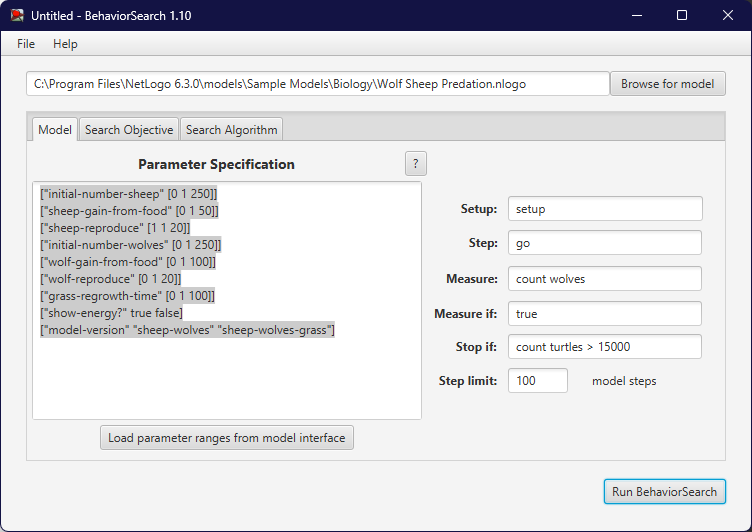
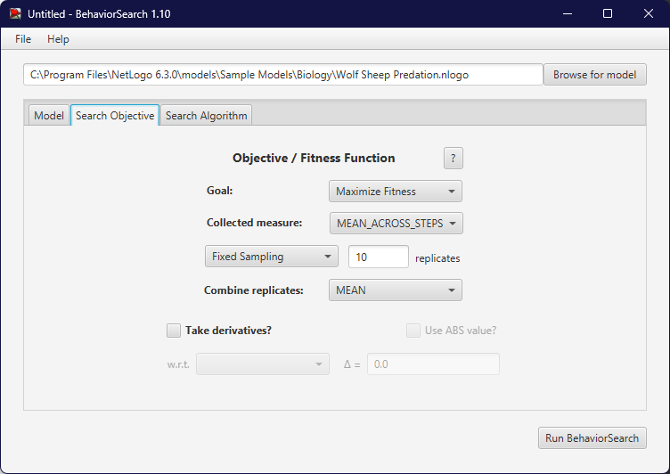
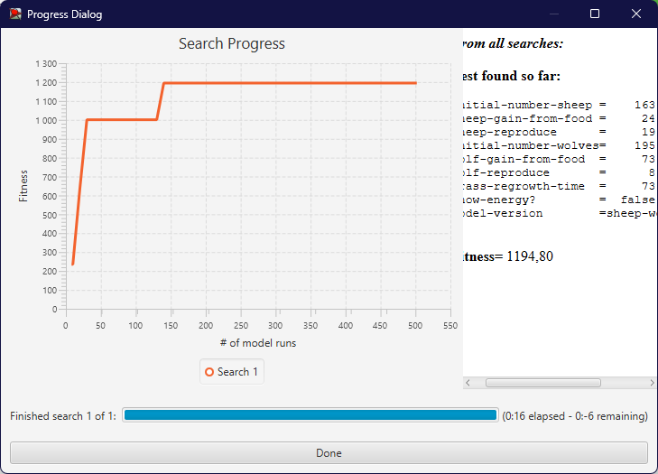
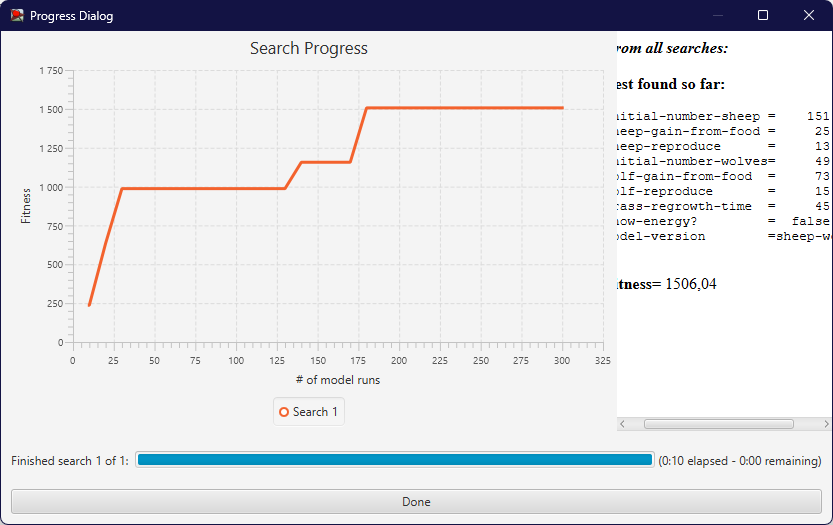

## Комп'ютерні системи імітаційного моделювання
## СПм-22-6, **Гунько Михайло Андрійович**
### Лабораторна робота №**3**. Використання засобів обчислювального интелекту для оптимізації імітаційних моделей

 

### Варіант 7, модель у середовищі NetLogo:
[Wolf Sheep Predation](https://www.netlogoweb.org/launch#http://www.netlogoweb.org/assets/modelslib/Sample%20Models/Biology/Wolf%20Sheep%20Predation.nlogo)

 

## Вербальний опис моделі:
Ця модель досліджує стабільність екосистем хижак-жертва. Така система називається нестабільною, якщо вона має тенденцію призводити до вимирання одного або кількох видів. Навпаки, система є стабільною, якщо вона прагне підтримувати себе протягом тривалого часу, незважаючи на коливання чисельності населення.
### Є два основних варіанти цієї моделі:

У першому варіанті, версії «вівці-вовки», вовки та вівці безладно блукають по ландшафту, а вовки шукають овець, на яких можна поласувати. Кожен крок коштує вовкам енергії, і вони повинні їсти овець, щоб відновити свою енергію - коли у них закінчується енергія, вони гинуть. Щоб забезпечити збереження популяції, кожен вовк чи вівця мають фіксовану ймовірність відтворення на кожному кроці часу. У цьому варіанті ми моделюємо траву як «нескінченну», щоб вівці завжди мали достатньо їжі, і ми явно не моделюємо поїдання або вирощування трави. Таким чином, вівці не отримують і не втрачають енергію під час їжі чи руху. Ця варіація створює цікаву динаміку популяції, але в кінцевому підсумку нестабільна. Цей варіант моделі особливо добре підходить для взаємодіючих видів у багатому живильному середовищі, наприклад, двох штамів бактерій у чашці Петрі.

Другий варіант, версія «вівці-вовки-трава», явно моделює траву (зелену) на додаток до вовків і овець. Поведінка вовків ідентична першому варіанту, але цього разу вівці повинні їсти траву, щоб зберегти свою енергію - коли вони закінчуються, вони гинуть. Після того, як траву з’їли, вона відростає лише через певний проміжок часу. Ця варіація складніша за першу, але загалом стабільна. Це ближче до класичних моделей коливань населення Лотки Вольтерра. Хоча класичні моделі LV припускають, що популяції можуть приймати реальні значення, але в невеликих популяціях ці моделі недооцінюють вимирання, а моделі на основі агентів, такі як наведені тут, дають більш реалістичні результати.

### Керуючі параметри:
- **model-version** - вибір версії моделі.
- **initial-number-sheep** - початкова кількість овець.
- **initial-number-wolves** - початкова кількість вовків.
- **grass-regrowth-time** - скільки часу потрібно, щоб трава відростала після того, як її з’їли.
- **sheep-gain-from-food** - Кількість енергії, яку вівці отримують за кожну з’їдену травинку.
- **wolf-gain-from-food** - кількість енергії, яку вовки отримують за кожну з’їдену вівцю.
- **sheep-reproduce** - ймовірність вівця розмножується на кожному кроці часу.
- **wolf-reproduce** - ймовірність розмноження вовка на кожному кроці часу.

### Параметри візуалізації:
- **show-energy** - показувати чи ні енергію кожної тварини як число?

### Показники роботи системи:
- **sheep** - поточна кількість овець.
- **wolves** - поточна кількість вовків.
- **grass** - поточна кількість трави.
- **populations** - графік, що відображує значення параметрів **sheep**, **wolves** та **grass**.

 

### Налаштування середовища BehaviorSearch:

**Обрана модель**:
<pre>
C:\Program Files\NetLogo 6.3.0\models\Sample Models\Biology\Wolf Sheep Predation.nlogo
</pre>
**Параметри моделі** (вкладка Model):  
*Параметри та їх модливі діапазони були **автоматично** вилучені середовищем BehaviorSearch із вибраної імітаційної моделі, для цього є кнопка «Завантажити діапазони параметрів із інтерфейсу моделі»*:
<pre>
["initial-number-sheep" [0 1 250]]
["sheep-gain-from-food" [0 1 50]]
["sheep-reproduce" [1 1 20]]
["initial-number-wolves" [0 1 250]]
["wolf-gain-from-food" [0 1 100]]
["wolf-reproduce" [0 1 20]]
["grass-regrowth-time" [0 1 100]]
["show-energy?" true false]
["model-version" "sheep-wolves" "sheep-wolves-grass"]
</pre>
Використовувана **міра**:  
Для фітнес-функції було обрано **значення кількості вовків** та вказано у параметрі "**Measure**":
<pre>
count wolves
</pre>

Загальний вигляд вкладки налаштувань параметрів моделі: 

**Налаштування цільової функції** (вкладка Search Objective):  
Метою підбору параметрів імітаційної моделі, є **максимізація** значення кількості вівець на полі – це вказано через параметр "**Goal**" зі значенням **Maximize Fitness**. Тобто необхідно визначити такі параметри налаштувань моделі, у яких виживає максимальні кількість вовків.
Загальний вигляд вкладки налаштувань цільової функції: 

**Налаштування алгоритму пошуку** (вкладка Search Algorithm):  
Загальний вид вкладки налаштувань алгоритму пошуку:  

 

### Результати використання BehaviorSearch:
Діалогове вікно виглядало настпуним чином:

Результат пошуку параметрів імітаційної моделі, використовуючи **генетичний алгоритм**:

Результат пошуку параметрів імітаційної моделі, використовуючи **випадковий пошук**:  

 
